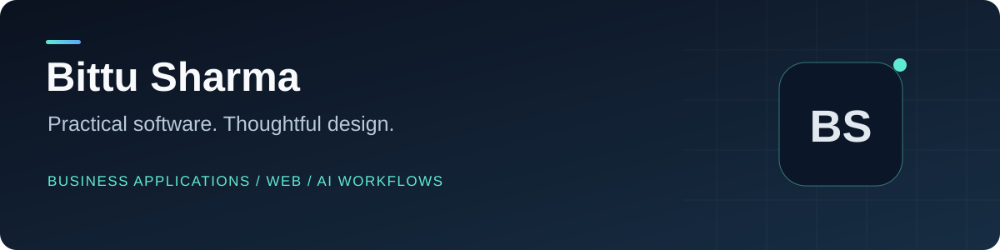

# Hi, I'm Bittu.

<!-- repo-badges:start -->

[Profile](https://github.com/honeyamn10-source) · [Repositories](https://github.com/honeyamn10-source?tab=repositories) · [Stars](https://github.com/honeyamn10-source?tab=stars)

<!-- repo-badges:end -->

<!-- professional-meta:start -->

 

  

[Portfolio](PORTFOLIO.md) · [Profile Setup](PROFILE_SETUP.md) · [Maintenance](REPOSITORY_MAINTENANCE.md) · [Website Report](WEBSITE_PORTFOLIO_REPORT.md)

<!-- professional-meta:end -->

I build developer tools, business applications and experiments in applied AI. My repositories explore how software can make everyday work clearer: checking configuration, managing operations and turning research ideas into repeatable tests.

[Explore my portfolio](https://honeyamn10-source.github.io/honeyamn10-source/) · [Browse repositories](https://github.com/honeyamn10-source?tab=repositories)

## Selected work

| Project | What it does |
| --- | --- |
| [envguard](https://github.com/honeyamn10-source/envguard) | Catch configuration mistakes early. |
| [tickstore](https://github.com/honeyamn10-source/tickstore) | Market data with a common interface. |
| [pos](https://github.com/honeyamn10-source/pos) | Restaurant operations, from order to service. |
| [pos-retail](https://github.com/honeyamn10-source/pos-retail) | Retail sales, inventory and daily operations. |
| [jawa-quant-computer](https://github.com/honeyamn10-source/jawa-quant-computer) | A local workspace for agent tasks. |
| [Quant_Lab](https://github.com/honeyamn10-source/Quant_Lab) | Reproducible experiments that challenge strategies. |

## Also on the workbench

- [pyagent](https://github.com/honeyamn10-source/pyagent) — A compact workspace for agent experiments.
- [truagent](https://github.com/honeyamn10-source/truagent) — Agent workflows with inspectable steps.
- [auto-shift](https://github.com/honeyamn10-source/auto-shift) — Browser automation with visible execution.
- [classy-renovation](https://github.com/honeyamn10-source/classy-renovation) — A clearer record of business expenses.
- [voice-order-system](https://github.com/honeyamn10-source/voice-order-system) — A conversational restaurant-order prototype.
- [punch.trade](https://github.com/honeyamn10-source/punch.trade) — A workstation for strategy research and paper execution.
- [galaxy_mvp](https://github.com/honeyamn10-source/galaxy_mvp) — Experiments in distributed event detection.

## How I approach a project

Start with a useful problem. Keep setup instructions close to the code. Test the critical path. Make the difference between a prototype and a deployed service clear.

Each repository documents its own requirements, implementation status and license. The portfolio's static project guides introduce the software; applications with servers or external providers need their documented runtime and configuration.

For a project question or a reproducible bug, use that repository's issue tracker.
